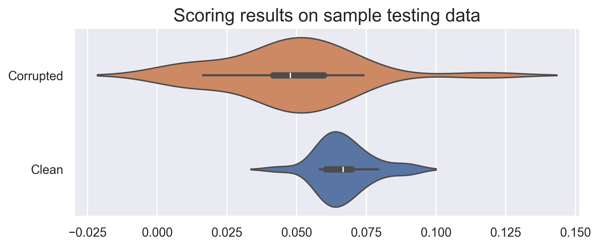

# Wudpecker-hackathon-project

Text classification microservice prepared for the 2023 Wudpecker AI hackathon. The primary goal of the service is early detection of heavily corrupted transcripts (for instance, due to incorrectly recognized language), before they are sent down the pipeline for summarization. 

## Usage
1. Clone this repository `git clone`
2. Create a Python virtual environment `python3 -m venv myenv`
3. Run the microservice `make all`
4. Open localhost of the microservice in browser at address `127.0.0.1:8080`
5. Send a `POST` request to `127.0.0.1:8080/score` with JSON string like this: `{"text": "abcxyz"}`
   where `abcxyz` is the actual content of the document that need to be checked

## Method

While exploring the provided sample data, we observed that in corrupted transcripts, consecutive words often appear semantically disconnected from each other, while in correctly transcribed conversations, consecutive words typically make sense together. We leveraged this observation to construct a scoring metric that differentiates nonsensical transcripts from ones that accurately transcribe the original conversation.

The steps for calculating the metric are roughly as follows:
1. First, we gather a corpus of verified transcripts to be used as training material. This data could be formed from a collection of various transcripts in Wudpecker's possession, or gathered from among texts produced by the specifically by the client to preserve confidentiality and improve customizability.
2. We then tokenize the texts and divide them into bigrams (pairs of consecutive tokens). The resulting bigram counts are stored in an instance of the `NgramCounter` class from the `nltk` package. 
3. At testing time, we tokenize the text to be tested and similarly divide it into bigrams. Then, for each resulting bigram, we calculate the frequency of that bigram within the training corpus, compared to the frequencies of those bigram with the same first token. For instance, when if we encounter a bigram "fluffy dog" in the tested text, we will count how many times "fluffy dog" appears in the training corpus, and divide by the total appearance count of the word "fluffy" in that corpus. The resulting value represents the likelihood of the encountered bigram appearing given the training texts as a statistical model.
4. Finally, we use the mean of the resulting ratios as the final score. 

## Preliminary results

The basic scoring method outlined above gives promising results on the provided sample data. The plot of the scores of the reserved test set of the verified transcripts and the scores of faulty transcript is provided below:

## Ideas for improvement

As it stands, the scoring procedure is very basic. We believe that separation power of the score could be further improved by introducing additional text pre-processing steps (such as removing punctuation and stop-words). Considering tri-grams could also be beneficial.

As for the code quality, there is certainly room for improvement. We ran into some time constraints and caffeine absorption rate limitations, and ended up skipping on the creation of automatic tests. Additionally, the API currently does not offer functionality for fitting the scorer on custom data.

<!-- ## Continuous Integration

We also provide Continuous Integration in `Makefile` and `.github/workflows/devops.yml`.

The continuous integration can be used for linting, formatting, testing, container building and running, and finally, deploying
to the desired platform. -->